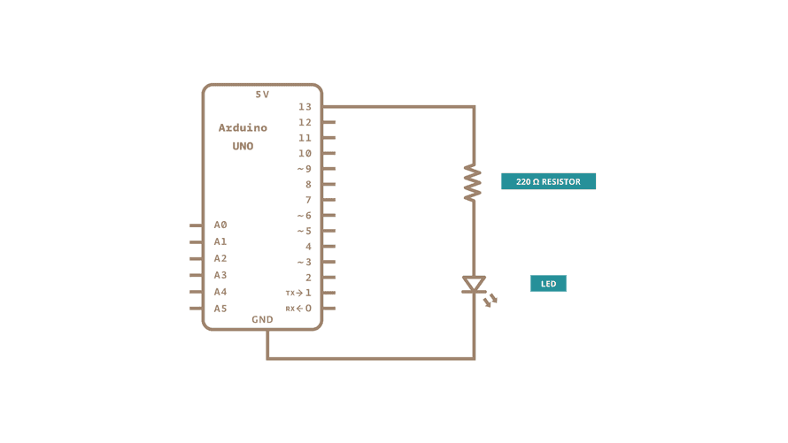
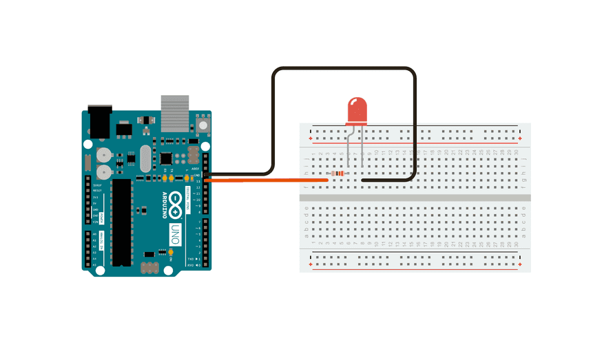

# Blink External LED — Arduino Uno

## Description
Blink an external LED connected to Pin 10 via a current-limiting resistor.

## Hardware
- Arduino Uno
- LED
- 220Ω Resistor
- Breadboard
- Jumper Wires

## Pin Configuration
| Component | Pin |
|-----------|-----|
| LED (+ Resistor) | 10 |
| GND | GND |

## Schematic

## Circuit

## How it works
1. LED turns ON for 500ms
2. LED turns OFF for 500ms
3. Repeats forever
